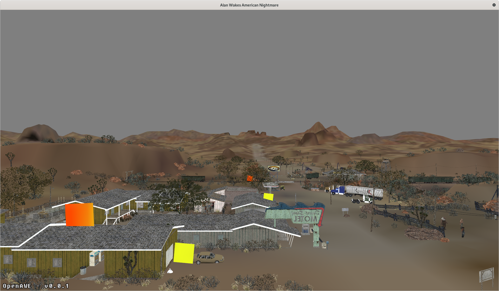

OpenAWE - Open Implementation of the Alan Wake Engine
=====================================================

OpenAWE is an open source reimplementation of Remedy Entertainments Alan Wake Engine, in later iterations known, as the 
Northlight Engine. The main goal is to have Alan Wake and its successor Alan Wakes American Nightmare working in a 
portable manner. The secondary goal is to also allow the successor games, Quantum Break and probably even Control
working with the same technical foundation. The code stands under the [GPL-3.0-or-later](https://spdx.org/licenses/GPL-3.0-or-later) License except for the libraries contained
the folder 3rdparty.

Screenshots
-----------
